## What is HTML?
- mark up language that defines structure of content
- consists of a series of elements

## Anatomy of an HTML element

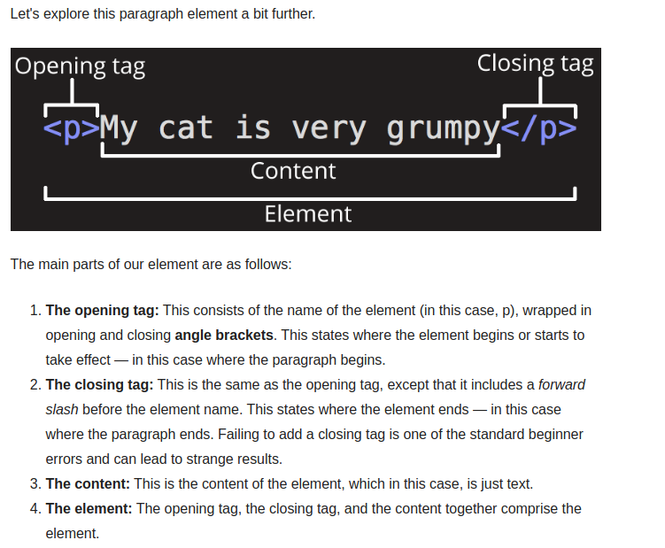

## Attributes
- elements can have attributes that contain additional info about element

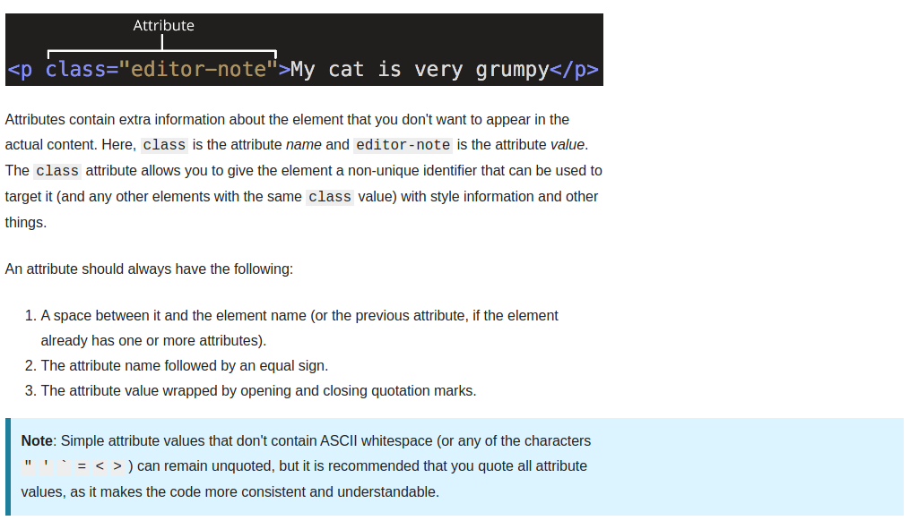
- class attribute allows you to give the element a non unique id that can be used to target it with style info, DOM, and other things

## Nesting Elements

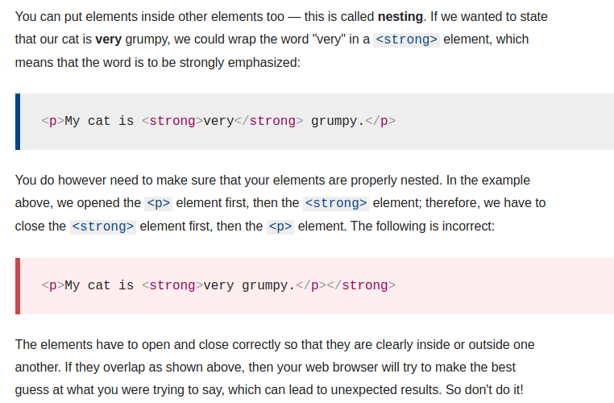

## Empty Elements

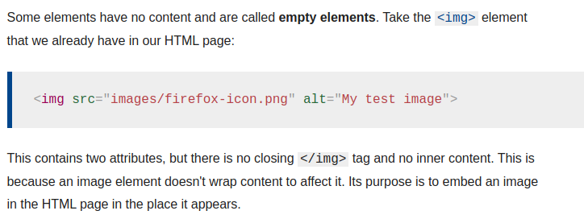

## Anatomy of an HTML Document

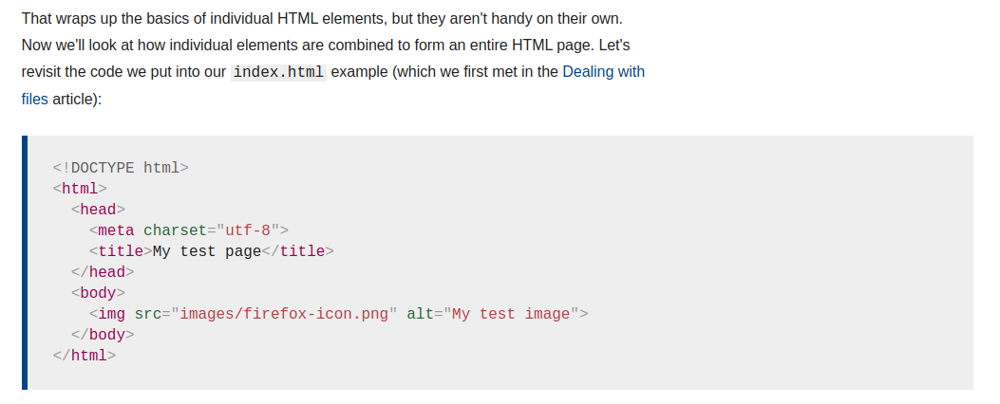

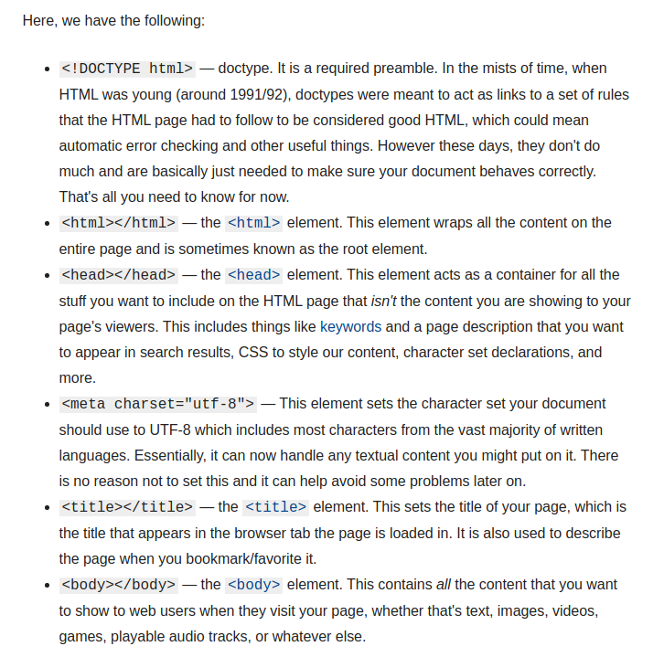

- `<head></head>` element contains metadata about document (not actual content)
  - It will have links to javascript scripts and css files, among other things

## Images
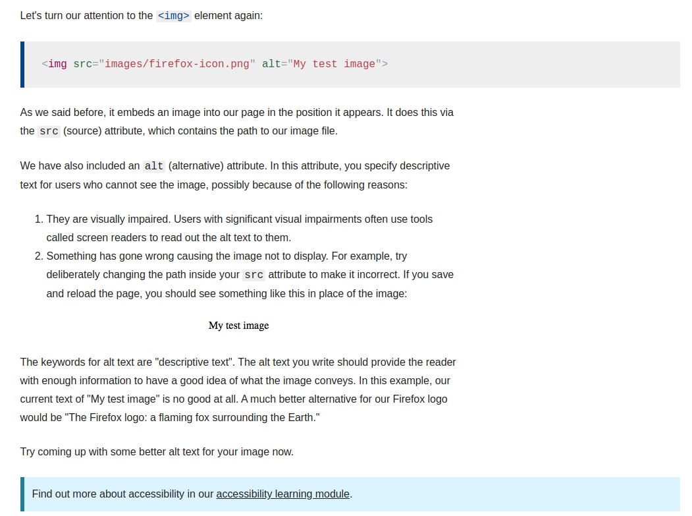

## Giving Structure to Web Page

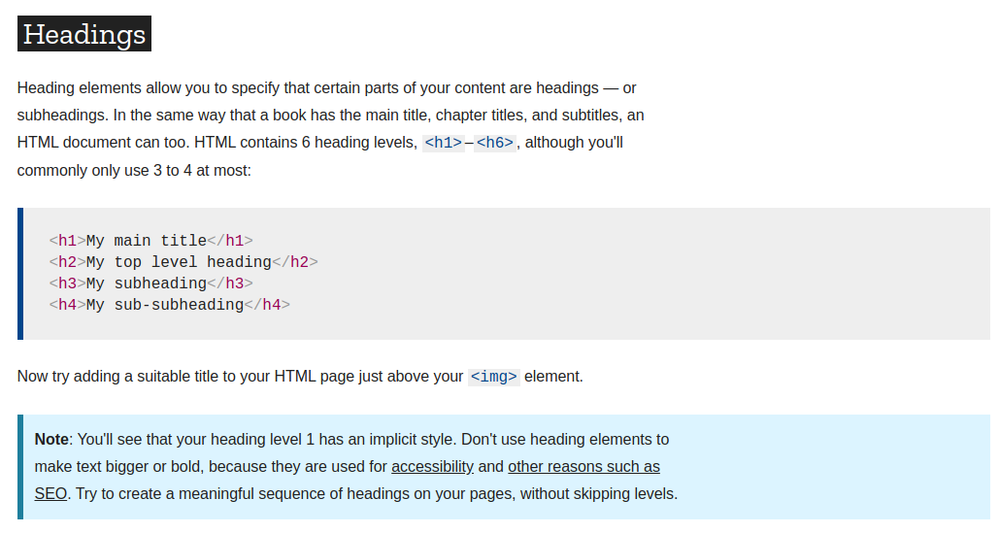

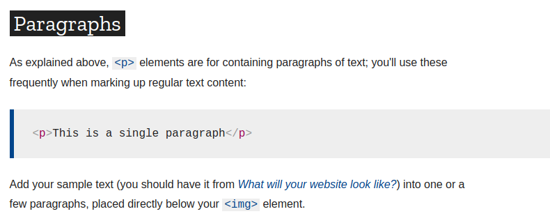

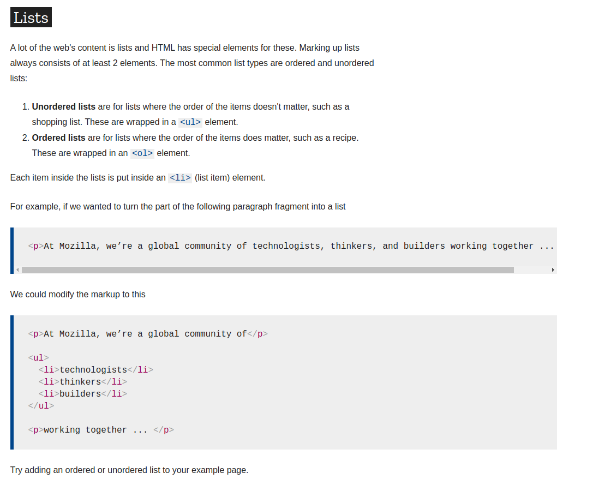

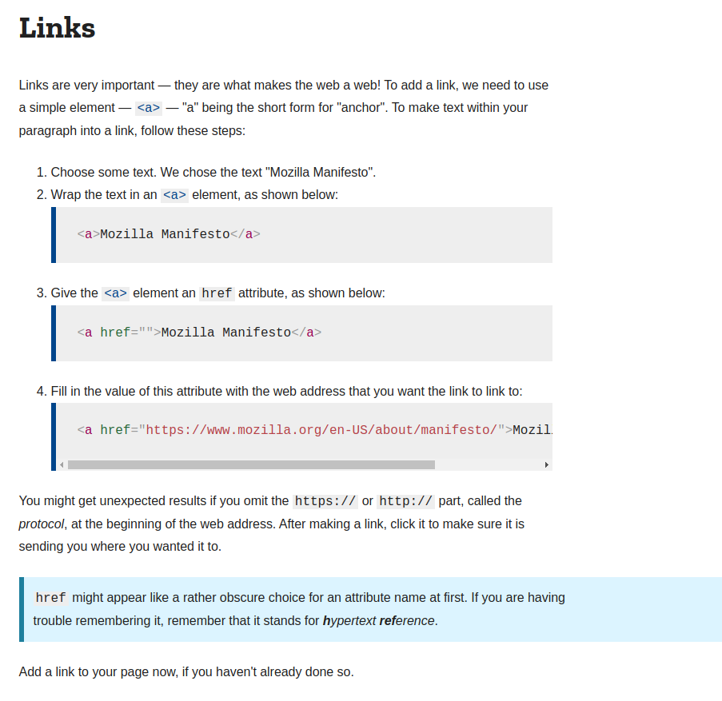
