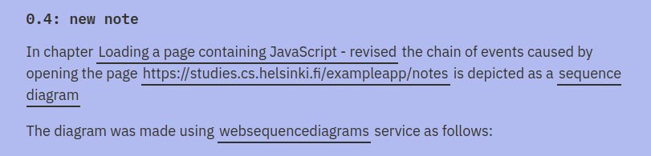

Exercise:



**My Submission:**
- made with https://www.websequencediagrams.com/


- correct confirmed by seeing requests in network tab after opening this url, https://studies.cs.helsinki.fi/exampleapp/notes and creating new note
<br>


## Further Analysis

### Redirect After POST /new_note

- Note, see the redirect location in response header after browser makes request 1)
- 302 status code indicates redirect


<br>
<br>

### `<link> and <script>` tags also initiate a `GET` HTTP call

<br>

**Request for main.css**


<br>

**Request for main.js**


Reponse:

```javascript
var xhttp = new XMLHttpRequest()

xhttp.onreadystatechange = function () {
  if (this.readyState == 4 && this.status == 200) {
    const data = JSON.parse(this.responseText)
    console.log(data)

    var ul = document.createElement('ul')
    ul.setAttribute('class', 'notes')

    data.forEach(function(note){
      var li = document.createElement('li')

      ul.appendChild(li);
      li.appendChild(document.createTextNode(note.content))
    })

    document.getElementById("notes").appendChild(ul)
  }
}

xhttp.open("GET", "/exampleapp/data.json", true)
xhttp.send()
```
<br>

### Call from within `main.js` to GET /data.json

- inside main.ls, we see an http client created, opened and a `GET` call to `/exampleapp/data.json`
- When `readyState` property of xhttp changes, the call back function defined by the property `onreadystatechange` is fired.

```javascript
function () {
  if (this.readyState == 4 && this.status == 200) {
    const data = JSON.parse(this.responseText)
    console.log(data)

    var ul = document.createElement('ul')
    ul.setAttribute('class', 'notes')

    data.forEach(function(note){
      var li = document.createElement('li')

      ul.appendChild(li);
      li.appendChild(document.createTextNode(note.content))
    })

    document.getElementById("notes").appendChild(ul)
  }
}
```


<br>


